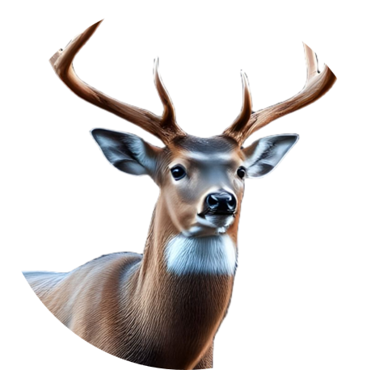

<p align="center">
    
</p>
<h1 align="center">
    BUCK
</h1>
<h2 align="center">
    Biometric Utilization of Cervid Kontours
</h2>


# Introduction
A tool for predicting the age of male whitetail deer based on trail camera images.

# Buck aging
## Introduction
There are many ways to predict the age a male whitetail deer. The most common method is to
look at the teeth, but this requires the aid of a professional. Other techniques have been deeply investigated including antler characteristics (mass, size, etc.) as
well as body proportions.

## Antler characteristics
Lindsay's studies have shown an increase in average antler mass as a function of
age. This is a good indicator of age, but it requires a professional to examine the
sheds. Furthermore, the curves are nonlinear and vary by region. This means that
the model must be trained on a specific region to be accurate, and this is not
practical for the average hunter. Other characteristics include average beam length,
circumference, and tine length, but these suffer from the same issues as mass.

## Supervised Learning
### BUCK
Alternatively, the NDA has provided a set of images and ratings for a number of
deer, which can be used to train a model to predict age based on images alone.
This is the method we will use in this project BUCK (Biometric Utilization of
Cervid Kontours). Images of the deer were taken from numerous websites,
publications, blog posts, videos, and tutorials from a multitude of 
institutions.

BUCK is working with a small but growing dataset. Because of this, different models
are built, compared, and optimized to find the best model for the task. The models
include canned classifiers (e.g. NaiveBayes, RandomForest, etc.), but also include
convolution neural networks (CNNs) and transfer learning. Each of these is built,
executed, and illustrated in separate Jupyter notebooks. The goal is to find the
best model for the task, and to provide a framework for future work in this area.

There is a statistical aspect, as well. Even though we desire to build an age
prediction model with the highest possible accuracy, we also want to sanity check
our output compared to the expectations from normal people in the field. This is
achieved by statistically comparing the age estimates from informed hunters compared
with the model's "truth", which is determined by institutions mentioned above.

#### CNN
To perform its analysis, BUCK uses a convolutional neural network (CNN) to extract
features from the images. The CNN is a type of deep learning model that is
particularly well-suited for image classification tasks. The model is trained on
a dataset of images and their corresponding age ratings, and learns to
recognize patterns in the images that are indicative of age. Once trained, the
model can be used to predict the age of new images of deer.

Images gathered from the website were sized and cropped, making sure to include the
full deer's body; non-square images were squared via cropping. The images were then resized amd interpolated to 224x224. The images were then split into training and test
sets, with 80% of the images used for training and 20% for testing. The training
set was then augmented using random rotations, flips, and brightness adjustments
to increase the size of the training set and improve the model's performance. At the end of the analysis, transfer learning is also consider to enhance model accuracy. 

# Installation!
*BUILT USING PYTHON 3.11.9*
```
# Create a new virtual environment
python -m venv buck-env

# Activate the virtual environment
.\buck-env\Scripts\activate

# Upgrade pip first
python -m pip install --upgrade pip

# Install setuptools explicitly first
python -m pip install setuptools wheel

# Install numpy explicitly (using a wheel)
python -m pip install numpy

# Then install your package
python -m pip install -e .

# Install the environment in Jupyter
python -m ipykernel install --user --name=buck-env --display-name="BUCK Environment"

```